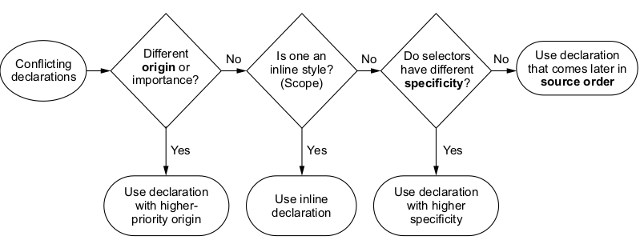

# La cascada en css

La cascada en CSS nos sirve para predecir como se van a aplicar las reglas que definimos en el navegador, cuando 2 o mas reglas apuntan a al mismo elemento de la pagina, podemos llegar a tener un conflicto con la regla que se vaya a aplicar.

por ejemplo si tenemos el elemento html

```html
<h1 id="page-title" class="tittle">El Jonny Coffee Shop</h1>
```

e intentamos aplicar los siguientes estilos

```css
h1{
    font-family: serif;
}

#page-title{
    font-family: sans-serif;
}
.title{
    font-family: monospace;
}

```

entonces cada una de las reglas va intentar especificar distintos tipos de fuente para el mismo elemento *h1*, pero esto no va ser posible ya que no puede haber 3 tipos de fuente en un solo elemento al mismo tiempo. entonces cual sera el que se aplique?

Para determinar esto el navegador sigue un conjunto de reglas, asi el resultado puede ser previsible. En este caso, las reglas dictan que la segunda regla ( la que tiene un selector ID) es la que va predominar sobre las demas, el titulo va tener una fuente sans-serif.

Este conjunto de reglas lo llamamos *cascada* y determina como se van a resolver los conflictos. Es una parte fundamental del lenguajes y muchas veces es incomprendida por la mayoria.

Cuando tenemos conflictos con nuestras declaraciones la cascada considera 3 aspectos para resolver las diferencias.

1. *Origen de la hoja de Estilos*: de donde provienen los estilos que estamos aplicando. nuestros estilos son aplicados en conjuncion con los que trae el navegador por defecto.

2. *especificidad del selector*: Que selectores toman predominancia sobre otros.

3. *Orden del codigo* : El orden en que los estilos son declarados en la hoja de estilos.



Las reglas de la cascada se aplican como en el grafico que vemos arriba.

## Origen de la hoja de estilos

Los estilos que definimos en nuestra hoja de estilo no son los unicos que el navegador aplica, tenemos diferentes tipos de estilos. Los *estilos de autor* son los definidos por nosotros mismos y los *user agent styles* son los estilos que vienen por defecto en el navegador. los user agent styles tienen menor prioridad que los estilos de autor, por lo tanto son sobre escritos por estos ultimos.

>Nota: algunos navegadores permiten a los usuarios una  *user-style-sheet*. Esta es considerada una tercera fuente con una prioridad intermedia entre la *user-agent-style* y la *hoja de estilos de autor*. Estos estilos son raramente usados.

### User Agent Style

Los *user-agent-styles* pueden variar levemente de navegador a navegador pero basicamente hacen lo mismo, les dan valores por defecto a las etiquetas \<h1-h6> ,\<p> de top y bottom margin , a las listas \<ul ol> le aplican left-padding  y definen colores de links y tamanos por defecto.

Luego de que se apliquen las *user-agent-styles* el navegador aplica nuestros estilos, esto le permite sobreescribir a los estilos del navegador en caso de que sea necesario

### Declaracion *!important*

Hay una excepcion al origen de la hoja de estilos: las declaraciones que son marcadas con *!important*.

```css
color: red !important;
```
estas declaraciones son tratadas como *higher-priority-origin*, entonces en este caso el conjunto de prioridades queda definido de la siguiente manera:

1. Author Important
2. Author
3. User Agent

## Especificidad del selector

Si los conflictos en las declaraciones no pueden ser resueltos mediante el origen de la hoja de estilos, el navegador intentara resolverlos mediante la *especificidad*.
El navegador evalua la *especificidad* en 2 partes: Estilos aplicados en el HTML y estilos aplicados usando un selector.

### Especificidad de estilos Inline

Si usamos un atributo *style* en una etiqueta HTML , estos seran aplicados solo a ese elemento y sobreescribiran cualquier declaracion hecha en nuestra hoja de estilos o nuestra etiqueta \<*style*>. Los estilos *inline* no tienen selector debido a que son aplicados directamente sobre el elemento al que apuntan. Se aplican de la siguiente manera:

```html
    <li>
        <a href="/specials"
            class="featured"
            style="background-color:orange">
            Specials
        </a>
    </li>
```

para sobreescribir una declaracion *inline* en nuestra hoja de estilos, debemos agregar un *!important* a la declaracion. Si lo estilos *inline* estan declarados como *!important* entonces no se podran sobreescribir

### Especificidad de Selectores

La segunda parte de la especificidad esta determinada por los selectores, por ejemplo un selector con 2 nombres de clases tiene una especificidad mas alta que uno con solo una.

veamos que sucede cuando queremos cambiar el color de fondo del elemento que contiene la clase *.featured* con un selector de clase

```css
#main-nav a{
    color:white;
    background-color:gray;
    padding:5px;
    border-radius:2px;
    text-decoration:none;
}

.featured{
    background-color:orange;
}
```

```html
<ul id="main-nav" class="nav">
                <li><a href="/">Home</a></li>
                <li><a href="/coffes">Coffees</a>  </li>
                <li><a href="/brewers">Brewers</a></li>
                <li><a href="/specials" class="featured" >Specials</a></li>
            </ul>
```

Esto no funciona, todos los links permanecen de color gris, esto es debido a que el primer selector *#main-nav a* esta formado por un ID y una etiqueta html y  es mas especifico que el segundo *.featured* que esta formado por una clase

Los diferentes tipos de selector tienen diferentes especificidades, por ejemplo un selector ID tiene mas especificidad que un selector con varias clases y un selector de clase tiene mas especificidad que un selector de etiqueta (tambien llamados *type selector*). Las reglas para la especificidad son las siguientes:

* Si un selector tiene mas ID's gana (tiene mas especificidad).

* Si tienen la misma cantidad de ID's, el selector que tenga mas clases es el que gana.

* Si tienen igual cantidad de clases e igual cantidad de clases, gana el que tenga mayor cantidad de etiquetas

> Nota: los selectores de Pseudo Clases (i.e :hover ) y selectores de atributos (i.e    [type="input"]) tienen la misma especificidad que un selector de clase, el selector ( * ) y los combinadores ( >, +, ~ ) no tienen efecto en la especificidad.

A menudo sucede que si agregamos una declaracion a nuestras reglas y esta no produce el efecto deseado, es porque alguna declaracion con mas especificidad esta sobreescribiendola.

Sucede que muchas veces los desarrolladores usan selectores de ID lo que hace que tengan una especificidad mas alta lo que los vuelve mas dificil de sobreescribir posteriormente.

### Una forma de indicar la especificidad

Una forma comun de especificar la especificidad es utilizando numeros separados por coma. Por ejemplo *1,2,1*  indica una especificidad  de un ID , dos clases y una etiqueta. ID's como tienen mas alta prioridad se indican primero (a la izquierda), seguidos de las clases y las etiquetas.

| Selector | ID's | Classes | Tag | Notacion|
|:------------------------------|:--:|:--:|:--:|---------:|
|html body header  h1|0|0|4|0,0,4|
|body header.page-header h1|0|1|3|0,1,3|
|.page-header .title|0|2|0|0,2,0|
|#page-tittle h1|1|0|0|1,0,0|

Ahora se hace muy sencillo encontrar al elemento con mas especificidad, solo tenemos que mirar en la tabla.

## Orden del codigo