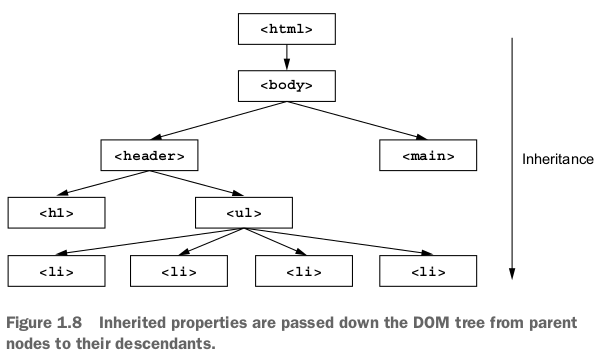

# Cascada

## La cascada en css

La cascada en CSS nos sirve para predecir como se van a aplicar las reglas que definimos en el navegador, cuando 2 o mas reglas apuntan a al mismo elemento de la pagina, podemos llegar a tener un conflicto con la regla que se vaya a aplicar.

por ejemplo si tenemos el elemento html

```html
<h1 id="page-title" class="tittle">El Jonny Coffee Shop</h1>
```

e intentamos aplicar los siguientes estilos

```css
h1{
    font-family: serif;
}

##page-title{
    font-family: sans-serif;
}
.title{
    font-family: monospace;
}

```

entonces cada una de las reglas va intentar especificar distintos tipos de fuente para el mismo elemento *h1*, pero esto no va ser posible ya que no puede haber 3 tipos de fuente en un solo elemento al mismo tiempo. entonces cual sera el que se aplique?

Para determinar esto el navegador sigue un conjunto de reglas, así el resultado puede ser previsible. En este caso, las reglas dictan que la segunda regla ( la que tiene un selector ID) es la que va predominar sobre las demás, el titulo va tener una fuente sans-serif.

Este conjunto de reglas lo llamamos *cascada* y determina como se van a resolver los conflictos. Es una parte fundamental del lenguajes y muchas veces es incomprendida por la mayoría.

Cuando tenemos conflictos con nuestras declaraciones la cascada considera 3 aspectos para resolver las diferencias.

1. *Origen de la hoja de Estilos*: de donde provienen los estilos que estamos aplicando. nuestros estilos son aplicados en conjunto con los que trae el navegador por defecto.
2. *especificidad del selector*: Que selectores toman predominancia sobre otros.
3. *Orden del código* : El orden en que los estilos son declarados en la hoja de estilos.


Las reglas de la cascada se aplican como en el grafico que vemos arriba.

### Origen de la hoja de estilos

Los estilos que definimos en nuestra hoja de estilo no son los únicos que el navegador aplica, tenemos diferentes tipos de estilos. Los *estilos de autor* son los definidos por nosotros mismos y los *user agent styles* son los estilos que vienen por defecto en el navegador. los user agent styles tienen menor prioridad que los estilos de autor, por lo tanto son sobre escritos por estos últimos.

>Nota: algunos navegadores permiten a los usuarios una  *user-style-sheet*. Esta es considerada una tercera fuente con una prioridad intermedia entre la *user-agent-style* y la *hoja de estilos de autor*. Estos estilos son raramente usados.

### User Agent Style

Los *user-agent-styles* pueden variar levemente de navegador a navegador pero básicamente hacen lo mismo, les dan valores por defecto a las etiquetas \<h1-h6> ,\<p> de top y bottom margin , a las listas \<ul ol> le aplican left-padding  y definen colores de links y tamaños por defecto.

Luego de que se apliquen las *user-agent-styles* el navegador aplica nuestros estilos, esto le permite sobrescribir a los estilos del navegador en caso de que sea necesario

### Declaración *!important*

Hay una excepción al origen de la hoja de estilos: las declaraciones que son marcadas con *!important*.

```css
color: red !important;
```

estas declaraciones son tratadas como *higher-priority-origin*, entonces en este caso el conjunto de prioridades queda definido de la siguiente manera:

1. Author Important
2. Author
3. User Agent

### Especificidad del selector

Si los conflictos en las declaraciones no pueden ser resueltos mediante el origen de la hoja de estilos, el navegador intentara resolverlos mediante la *especificidad*.
El navegador evaluá la *especificidad* en 2 partes: Estilos aplicados en el HTML y estilos aplicados usando un selector.

### Especificidad de estilos Inline

Si usamos un atributo *style* en una etiqueta HTML , estos serán aplicados solo a ese elemento y sobrescribirán cualquier declaración hecha en nuestra hoja de estilos o nuestra etiqueta \<*style*>. Los estilos *inline* no tienen selector debido a que son aplicados directamente sobre el elemento al que apuntan. Se aplican de la siguiente manera:

```html
    <li>
        <a href="/specials"
            class="featured"
            style="background-color:orange">
            Specials
        </a>
    </li>
```

para sobrescribir una declaración *inline* en nuestra hoja de estilos, debemos agregar un *!important* a la declaración. Si lo estilos *inline* están declarados como *!important* entonces no se podrán sobrescribir

### Especificidad de Selectores

La segunda parte de la especificidad esta determinada por los selectores, por ejemplo un selector con 2 nombres de clases tiene una especificidad mas alta que uno con solo una.

veamos que sucede cuando queremos cambiar el color de fondo del elemento que contiene la clase *.featured* con un selector de clase

```css
#main-nav a{
    color:white;
    background-color:gray;
    padding:5px;
    border-radius:2px;
    text-decoration:none;
}

.featured{
    background-color:orange;
}
```

```html
<ul id="main-nav" class="nav">
                <li><a href="/">Home</a></li>
                <li><a href="/coffes">Coffees</a>  </li>
                <li><a href="/brewers">Brewers</a></li>
                <li><a href="/specials" class="featured" >Specials</a></li>
            </ul>
```

Esto no funciona, todos los links permanecen de color gris, esto es debido a que el primer selector *#main-nav a* esta formado por un ID y una etiqueta html y  es mas especifico que el segundo *.featured* que esta formado por una clase

Los diferentes tipos de selector tienen diferentes especificidades, por ejemplo un selector ID tiene mas especificidad que un selector con varias clases y un selector de clase tiene mas especificidad que un selector de etiqueta (también llamados *type selector*). Las reglas para la especificidad son las siguientes:

* Si un selector tiene mas ID's gana (tiene mas especificidad).

* Si tienen la misma cantidad de ID's, el selector que tenga mas clases es el que gana.

* Si tienen igual cantidad de clases e igual cantidad de clases, gana el que tenga mayor cantidad de etiquetas

> Nota: los selectores de Pseudo Clases (i.e :hover ) y selectores de atributos (i.e    [type="input"]) tienen la misma especificidad que un selector de clase, el selector ( * ) y los combinadores ( >, +, ~ ) no tienen efecto en la especificidad.

A menudo sucede que si agregamos una declaración a nuestras reglas y esta no produce el efecto deseado, es porque alguna declaración con mas especificidad esta sobrescribiendola.

Sucede que muchas veces los desarrolladores usan selectores de ID lo que hace que tengan una especificidad mas alta lo que los vuelve mas difícil de sobrescribir posteriormente.

### Una forma de indicar la especificidad

Una forma común de especificar la especificidad es utilizando números separados por coma. Por ejemplo *1,2,1*  indica una especificidad  de un ID , dos clases y una etiqueta. ID's como tienen mas alta prioridad se indican primero (a la izquierda), seguidos de las clases y las etiquetas.

| Selector | ID's | Classes | Tag | Notación|
|:------------------------------|:--:|:--:|:--:|---------:|
|html body header  h1|0|0|4|0,0,4|
|body header.page-header h1|0|1|3|0,1,3|
|.page-header .title|0|2|0|0,2,0|
|#page-tittle h1|1|0|0|1,0,0|

Ahora se hace muy sencillo encontrar al elemento con mas especificidad, solo tenemos que mirar en la tabla.

### Orden del código

El ultimo paso para resolver la cascada es el orden del código. Si el origen y la especificidad son las mismas, entonces la declaración que aparezca después en la hoja de estilos, o si la declaración se encuentra en una hoja de estilos que fue agregada después, entonces tendrá prioridad.

```css
.nav a {
color: white;
background-color: #13a4a4;
padding: 5px;
border-radius: 5px;
text-decoration: none;

}

a.featured{
    background-color:orange;
}
```

En este ejemplo las especificidades son iguales, el orden del código. es el que determina cual declaración es aplicada a nuestro link ( en este caso la segunda)

### Estilos de links y orden del código.

Los estilos para los links deben seguir un cierto orden ya que esto afecta a la cascada, el orden que se debe seguir es el siguiente:

```css
a:link{
    color:blue;
    text-decoration:none;
}

a:visited{
    color:purple;
}
a:hover{
    text-decoration:underline;
}
a:active{
    color:red;
}
```

dado a que tienen la misma especificidad, el orden es el que importa, los últimos estilos son los que sobrescriben a los primeros, una manera mnemotecnica de recordar esto es usando la relación LoVe/HAte *Link, Visited,Hover,Active*

### Reglas útiles

Hay dos reglas comunes para el trabajo con la cascada que pueden ser muy útiles

1. *No usar ID's en tus selectores*, Un solo selector de ID puede aumentar de manera significativa la especificidad. Cuando necesitamos sobrescribir el selector, comúnmente no tenemos otro ID  para utilizar, entonces terminamos usando una copia del original y agregando una clase para distinguirlo del que estamos tratando de sobrescribir.

2. *No usar !important*, esto es incluso mas difícil de sobrescribir que  un ID, y una vez que lo usamos debemos agregarlo cada vez que queramos sobrescribir la declaración original y todavía tenemos que lidiar con la especificidad.

Estas dos reglas son un buen consejo y funcionan la mayoría del tiempo, aunque pueden existir algunas excepciones.

## Herencia

Existe otra manera en que un elemento puede recibir estilos: mediante la *herencia*. La cascada esta a menudo combinada con la herencia, pero aunque estos términos estén relacionados debemos tener un claro entendimiento de como funcionan por separado.

Si un elemento no tiene un valor de cascada para una propiedad dada, puede heredarla de el elemento ancestro. Es común aplicar *font-family* al elemento \<body> , de esa manera todos los elementos hijos tendrán esta fuente y de esa manera no tendremos que aplicarla a todos los elementos por separado.



No todas las propiedades son heredadas, solo algunas, pero en general son las propiedades que quisiéramos heredar. La mayoría de ellas son propiedades pertenecientes al texto

```css
color , font , font-family , font-size , font-weight , font-variant ,
font-style , line-height , letter-spacing , text-align , text-indent , text-transform ,
white-space , word-spacing .
```

 y otras pocas pertenecientes a las listas, como:

 ```css
 list-style , list-style-type , list-style-position ,list-style-image.
 ```

  La herencia sera pasada de elemento a elemento hasta que sea sobre escrita por un valor de cascada (*cascaded value*)

>*cascaded value* — Un valor para una propiedad en particular, aplicada a un elemento como resultado de la cascada

## Valores Especiales

Hay 2 valores especiales que podemos aplicar a cualquier propiedad para modificar el valor de la cascada: *inherit*  y *initial*

### Inherit

Alguna vez quizás necesitemos que la herencia tome lugar, cuando un valor de cascascada lo esta previniendo. Para esto podemos utilizar la palabra reservada *inherit*. Esto sobrescribirá el valor que estaba dado por la cascada y tomara el valor de su padre

```css
.footer a {
    color:inherit;
    text-decoration:underline;
}
```

esto va a heredar los colores de fuente de la clase footer para los links que estén dentro. El beneficio es que el color de los links cambiara directamente cuando cambiemos el color del padre (en este caso \<footer>)

### Initial

En algún momento quizás necesitemos que los estilos aplicado a un elemento sean descartados. Podemos hacer esto utilizando *initial* . Cada propiedad de css tiene un valor inicial o por defecto. Cuando  usamos *initial* efectivamente devolvemos la propiedad a su estado inicial.

```css
.footer a {
    color:initial;
    text-decoration:underline;
}
```

en este caso el link tomara el color negro que es el que tienen la mayoría de los navegadores por defecto. Tener en cuenta que *initial* va restablecer el valor de la propiedad a su estado inicial, no, el estado del elemento

## Propiedades atajo (shorthands properties)

Las propiedades atajo son propiedades que nos permiten definir el valor de varias propiedades de una sola vez. por ejemplo la propiedad *font* que nos permite definir varias propiedades para las fuentes es un atajo para *font-style ,font-weight, font-size, line-height, font-family*  

```css
font: italic bold 18px/1.2 "Helvetica", "Arial", sans-serif;
```

### Cuidado con shorthands que sobrescriben otros estilos

La mayoría de las propiedades atajo nos permiten omitir valores y solo especificar las que necesitamos modificar. Pero es importante saber que aunque los omitamos igualmente estos valores son sobrescritos y esto puede sobrescribir valores que hayamos definido previamente. el shorthand font es el que puede producir mas errores en este sentido. si bien las propiedades atajo son muy buenas porque nos permiten tener nuestro código. mas limpio, debemos tener cuidado con estos detalles.

### Entendiendo el orden de los shorthands

Las propiedades atajo tienden a ser permisivas con el orden en que le pasamos los valores de las propiedades, por ejemplo podemos hacer:

```css
border: 1px solid black
```

o también:

```css
border: black 1px solid
```

y las dos van a funcionar correctamente, esto es porque el navegador tiene claro que valor asignar a cada propiedad. Pero hay ciertos casos donde estos valores pueden ser ambiguos, en esos casos debemos respetar cierto orden

#### Top, Right, Bottom Left

Las propiedades atajo tienden a confundirnos cuando se trata de *padding* y *margin*  o algunas propiedades de bordes. para estas propiedades los valores empiezan en top y siguen una forma horaria hacia right bottom y left. También es de ayuda recordar la palabra *TRouBLe*

estas propiedades también soportan valores truncados , si la declaración termina antes de que se especifique un valor de los lados , ese lado toma el valor de su opuesto, si especificamos tres valores el lado izquierdo tomara el valor de la derecha , si especificamos dos valores el top y bottom usaran el primero de los 2 y por ultimo si especificamos un solo valor este se usara en las 4 propiedades.