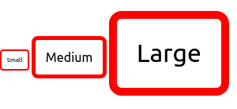

# Trabajando con unidades relativas

Cuando se trata de especificar valores, CSS nos ofrece una amplia gama de opciones. Una de las mas familiares y probablemente la mas fácil de usar son los *pixeles*, estas son llamadas unidades *absolutas* . Otras unidades como *em* y *rem* son *relativas* el valor de estas cambia respecto a valores externos.

## El poder de los valores relativos

### Ems y Rems

Los ems son las unidades de medidas relativas mas comunes, son unidades utilizadas en tipografía, referidos a un tamaño en especifico, en CSS *1em* significa el tamaño de fuente del elemento actual. Su tamaño exacto varia dependiendo del elemento al cual se lo estamos aplicando.

```css
.padded{
    font-size: 20px;
    background-color: aqua;
    border: 1px solid black;
    padding: 1em;
}
```

Este padding tiene un valor de 1em, el cual al ser procesado por el navegador multiplicara ese valor por el valor de la fuente de elemento y nos da como resultado un valor computado de 20px. Los valores relativos siempre son computados por el navegador y nos devuelven un valor absoluto.

Utilizar ems puede resultarnos muy conveniente cuando estamos seteando propiedades como *padding, height,width,border-radius* porque estos escalaran de forma proporcional, incluso si el elemento hereda diferentes tipos de fuentes, o si el usuario cambia el tamaño de las fuentes.

Por ejemplo utilizando ems podemos definir unas cajas que adapten su padding dependiendo del tamaño de fuente

```css
.box{
    display: inline-block;
    border-radius: .5em;
    padding: .8em;
    border: .3em solid red;
}
```

y entonces ahora si agregamos unos estilos que cambien nuestra fuente, podemos fácilmente modificar el tamaño de nuestras cajas

```css
.box-small{
    font-size: 8px;
}

.box-medium{
    font-size: 16px;
}

.box-large{
    font-size: 32px;
}
```

y así obtendremos el siguiente resultado:



#### Utilizando ems para definir tamaños de fuentes

Cuando se trata de la propiedad *font-size* los ems se comportan de manera diferente, como dijimos los ems  están definidos por el tamaño de fuente actual, pero que sucede si declaramos el tamaño de fuente como 1.2 em ?. El tamaño de fuente no puede ser 1.2 veces su tamaño. Entonces lo que sucede en este caso es para calcular el valor absoluto del tamaño de fuente, se va a utilizar la fuente heredada, veamos lo en un ejemplo.

```css
body{
    font-size: 16px;
}

.slogan{
    font-size:1.5em;
}
```

la clase slogan va asignar un tamaño de fuente de 1.5 veces el tamaño de body esto es 24px

> En la mayoría de los navegadores el tamaño predeterminado de una fuente es de 16px

#### Ems para *font-size* junto con ems para otros propiedades

Ya utilizamos ems para definir el padding de un elemento y ems para definir el tamaño de una fuente, pero que sucede cuando queremos utilizarlos de manera simultanea en un solo elemento?.

```css
.box2{
    font-size: 1.2em;
    padding: 1.2em;
    border: .5 em solid red;
}
```

en este caso lo que sucede es que primero se calcula el tamaño de la fuente utilizando los ems que le especificamos (1.2) y el tamaño de fuente heredado (16px del \<body>)
entonces obtenemos un tamaño absoluto de 19,2px, luego se utiliza ese valor junto con el valor en ems del padding y el border, para obtener sus valores computados, para este ejemplo obtendríamos padding: 23.033px y border: 9px.

>nota para el futuro, el valor del padding obtenido para el borde debería ser 9,6px pero el navegador para esta propiedad solo acepta valores enteros y lo trunca a 9px.

#### Problema con el encogimiento de la fuentes

Los ems pueden producir problemas cuando los utilizamos para definir el tamaño de las fuentes de elementos anidados. Para saber el valor exacto de cada elemento , tendremos que conocer el tamaño de su fuente heredada, la cual esta definida en el padre mediante ems, que a su vez necesitara saber el tamaño de su fuente heredada y así sucesivamente.

por ejemplo sucede en este caso:

```css
body{
    font-size:16px
}
ul{
    font-size: .8em;
}
```

```html

    <ul>
        <li> Top Level
            <ul>
                <li> Second Level
                    <ul>
                        <li>Third Level</li>
                        <li>Third level</li>
                    </ul>
                </li>
            </ul>
        </li>
    </ul>

```

cada elemento de la lista tendra 0.8 veces el tamano de la fuente heredada de su padre.

una forma para solucionar este problema de encogimiento  es con el siguiente codigo

```css
ul{
    font-size: .8em
}
ul ul{
    font-size: 1em
}
```

esto va a solucionar nuestro problema, pero no es la manera mas ideal, porque estamos asignado un valor e inmediatamente sobrescribiendolo con otra regla, seria mejor si tenemos una herramienta que solucione el problema sin tener que aumentar la especifidad de un selector. Por suerte si tenemos otra opcion y son los *rems*

### Utilizando rems para el tamano de fuente

Cuando el navegador  parsea un documento HTML, crea una representacion en memoria de todos los elementos en la pagina. A esta representacion la llamamos DOM, es una estructura de arbol donde cada elemento es representado por un nodo. El  nodo \<html> se encuentra en el nivel superior del arbol (o raiz), debajo se encuentran sus hijos \<head> y \<body> y debajo de estos sus hijos e hijos de hijos y asi sucesivamente.

El nodo raiz que es el ancestro de todos los elementos del documento, tiene un selector especial de pseudoclase *( :root )* que podemos utilizar para alcanzarlo, esto es similar a utilizar el selector de etiqueta *html* pero con la especificidad de una pseudoclase en vez de la de una etiqueta.

Rem es un acronimo para *Root Em*, a diferencia de ser relativos al elemento que los contiene los Rems son relativos al nodo raiz *(html)*. No importa donde lo apliquemos 1.2 rem tienen el mismo valor computado en todo el documento: 1.2 veces el tamano de fuente del elemento raiz

 ```css
 :root{
     font-size: 1em;
 }
 ul{
    font-size: .8rem;
 }
 ```

 en el ejemplo superior, el tamano de fuente del elemento raiz es 16px (*un em definido en el root es equivalente al tamano de fuente del navegador por defecto*) *ul* tiene un tamano especificado de .8rem por lo que siempre se calculara como 12.8px porque al ser relativo a la raiz, el tamano permanecera constante a pesar de estar anidado.

### Unidades relativas ViewPort

Ya sabemos que los ems y rems son unidades relativas, pero estas no son las unicas. Tambien existen las *Unidades relativas ViewPort* para definir unidades que sean relativas al viewport del browser

>*viewPort*-- es el area enmarcada en la ventana del navegador donde la pagina web es visible. Excluye si se encuentran presentes la zona de barras de navegacion, direccion, status, herramientas, etc.

#### Una breve explicacion sobre viewPorts

* *vh* - es equivalente al 1% del height del viewport.
* *vw* - es equivalente al 1% del width del viewport.
* *vmin* - es equivalente al 1% de la dimension mas pequena ya sea height o width.
* *vmax* - es equivalente al 1% de la dimension mas grande ya sea height o width.

por ejemplo un 50vh sera equivalente a la mitad de la altura del viewport y *vmin* estara basando en cual de los 2 (ancho o alto) sea mas pequeno

el siguiente codigo muestra un cuadrado que se vera igual en diferentes tamanos de viewports

```css
.square{
    width: 50vmin;
    height: 50vmin;
    background-color: blue;
}
```

las unidades relativas de longitud son ideales para cuando queremos una imagen que llene el tamano completo de nuestra pantalla, sin saber de antemano cual va a ser ese tamano

#### Utilizando vw para tamano de fuente

una aplicacion para las *unidades relativas viewport* que no es inmediatamente obvia es el tamano de fuente.

Consideremos que sucederia si aplicamos a la propiedad *font-size* un  valor de 2vw. En un monitor de 1200px, esto se evaluaria a 24px (2% de 1200). En una tablet con un ancho de pantalla de 768px esto serian 15px. y lo bueno seria que el elemento se escalaria de manera mas suave sin ningun cambio abrupto entre los 2 tamanos. 
Desafortunadamente 24px es un tamano muy grande en una pantalla de 1200px y seria muy pequeno en caso de un telefono. Seria algo muy util si podriamos manejar ese rango de valores pero sin llegar los extremos de muy pequeno o muy grande, para esto podemos usar la funcion de CSS *calc( )*

#### Utilizando la funcion Calc() para font-size

la funcion *calc()* nos permite hacer operaciones aritmeticas  basicas entre 2 valores. Esta es muy util para combinar valores de medidas que estan tomados en diferentes unidades por ejemplo *calc( 10px + 1em)*, entonces para resolver la situacion planteada anteriormente, podemos utilizar calc() de la siguiente manera para combinar vw y ems

```css
:root{
    font-size: calc(0.5em + 1vw);
}
```
ahora si vamos lentamente escalando el tamano de nuestro navegador veremos que la fuente escala suavemente. el 0.5em actua como una suerte de tamano minimo de la fuente y el 1vw hace escalar la fuente responsivamente a medida que aumenta el ancho de nuestra ventana. esto no daria un tamano de fuente minima de 11,75px en un telefono como un iphone 6 y un tamano de 20px en un monitor de 1200px. podemos ir ajustando estos valores de la manera que nos sea mas conveniente.

De esta manera logramos tener un texto que sea responsivo sin tener que utilizar media queries y sin tener saltos abruptos entre tamano y tamano.
